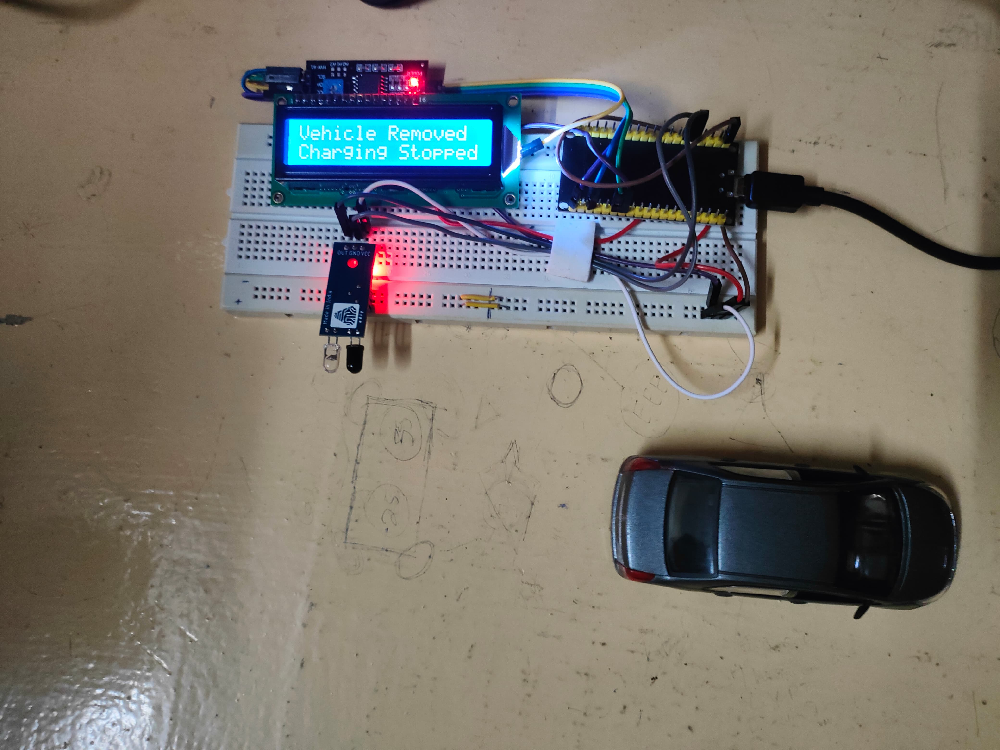
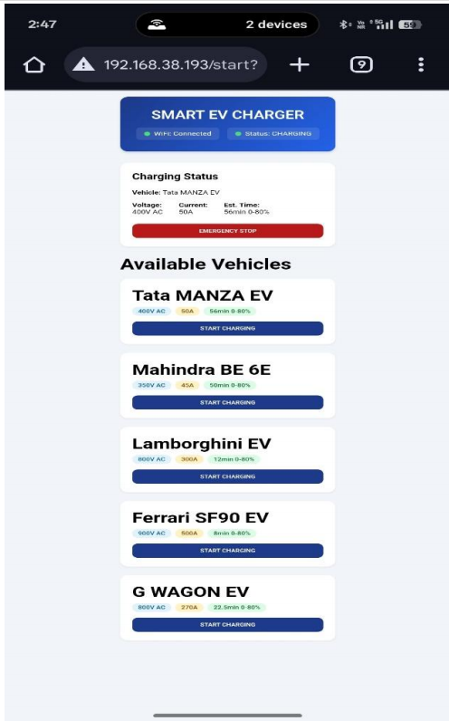

# Initialisation of EV Charging

A smart IoT-based system for automatic vehicle detection and charging initialization at EV charging stations using ESP-WROOM 32 microcontroller.

## Overview

This project implements an intelligent initialization system for Electric Vehicle (EV) wireless power transmission (WPT) charging stations. The system automatically detects vehicle presence and provides a user-friendly interface for initiating the charging process based on specific vehicle model requirements.

## Features

- **Automatic Vehicle Detection**: IR sensor-based vehicle presence detection at charging station entry
- **Smart Power Management**: ESP-WROOM 32 activates only when vehicle is detected, conserving energy
- **Vehicle-Specific Charging**: Pre-trained dataset of vehicle models with their respective power requirements
- **User Interface**: Web-based UI accessible via IP address for charging initialization
- **Real-time Status Display**: LCD display showing charging station and WPT unit status
- **Emergency Stop**: Immediate charging termination option for user safety
- **Automatic Reset**: System returns to initial state when vehicle departs

## Hardware Components

- **ESP-WROOM 32** - Main microcontroller with Wi-Fi and Bluetooth capabilities
- **IR Sensor** - Vehicle detection component placed at charging station entrance
- **LCD Display** - Status display for charging station information
- **WPT Unit** - Wireless Power Transmission charging infrastructure

## Hardware Prototype

*Fig. 1. Hardware Prototype of EV Charging Initialization System*

## System Architecture

### ESP-WROOM 32 Module

The ESP-WROOM 32 is a versatile and high-performance module that integrates Wi-Fi, Bluetooth, and Bluetooth Low Energy (LE) connectivity. Designed to cater to a broad spectrum of applications, it excels in both power-efficient sensor networks and more intensive tasks such as audio processing, MP3 decoding, and music streaming. These capabilities make it an ideal choice for developers looking to implement wireless communication in innovative projects.

### User Interface

*Fig. 2. Demonstration of a User Interface*

The user interface provides a web-based platform for vehicle model selection and charging initialization. Users access the UI through the IP address displayed on the LCD screen after connecting to the Wi-Fi network via QR code.

## Working Principle

### Basic Operation Flow

1. **Vehicle Detection**: IR sensor at entry point detects vehicle presence
2. **System Activation**: ESP-WROOM 32 powers on and establishes Wi-Fi connection
3. **Connection Details**: LCD displays IP address and QR codes for Wi-Fi access
4. **User Authentication**: User connects to same Wi-Fi network via QR code
5. **Vehicle Selection**: User selects their vehicle model from the trained dataset
6. **Charging Initialization**: Communication established between vehicle and WPT mains supply
7. **Automatic Deactivation**: System resets when vehicle leaves the station

### Operational Scenarios

#### Scenario 1: No Vehicle Detected
When no vehicle is present at the charging station, the IR sensor remains inactive. The LCD display shows "No Vehicle, Please Park" indicating the station is ready for vehicle arrival.

#### Scenario 2: Vehicle Detection and Connection
When a vehicle enters the charging station, the IR sensor detects it and activates the ESP-WROOM 32. The system connects to the Wi-Fi router, and the LCD displays the IP address and charging status as "IDLE". The user accesses the UI using the displayed IP address.

#### Scenario 3: Charging Initialization
The user selects their respective vehicle model in the UI and presses the "Start Charging" icon. An "Emergency Stop" icon is available for immediate charging termination during emergencies.

#### Scenario 4: Vehicle Departure
When the vehicle leaves after charging completion, the IR sensor detects the absence and turns off the ESP-WROOM 32. The LCD displays "Vehicle Removed, Charging Stopped" as the system resets to its initial state.

| Scenario | Detection State | System Response |
|----------|----------------|-----------------|
| No Vehicle | IR sensor inactive | ESP-WROOM 32 off, LCD shows "No Vehicle, Please Park" |
| Vehicle Present | IR sensor active | ESP-WROOM 32 on, Wi-Fi connected, charging state "IDLE" |
| Charging Initialized | User confirms via UI | Charging begins based on vehicle model specifications |
| Vehicle Removed | IR sensor detects departure | System resets, LCD shows "Vehicle Removed, Charging Stopped" |

## Project Files

- `Prototype.jpg` - Hardware prototype image
- `mainservercode___FINAL.ino` - Main microcontroller code for ESP-WROOM 32
- `UI.png` - User Interface demonstration screenshot

## Methodology

The implementation utilizes IoT communication between:
- Vehicle and WPT unit mains supply
- ESP-WROOM 32 microcontroller
- User mobile/laptop device

The ESP-WROOM 32 serves as the central controller, managing:
- Wi-Fi and Bluetooth connectivity
- Sensor data processing
- User interface hosting
- Charging protocol initialization

QR codes of the IP address and Wi-Fi connectivity are provided to the user. The IP address can also be typed manually in the browser as displayed on the LCD below the charging status.

## Applications

- **Electric Vehicle Charging Stations**: Primary application for future EVs
- **Public Transport**: Three-wheeler EVs commonly used in public transportation
- **Smart Infrastructure**: Cost-efficient solution requiring minimal sensors

## Advantages

- **Cost-Efficient**: Minimal sensors and microcontrollers required
- **Energy Saving**: Automatic activation/deactivation based on vehicle presence
- **User-Friendly**: Intuitive web-based interface with emergency controls
- **Improved Detection Efficiency**: Validated hardware implementation
- **Enhanced System Reliability**: Robust initialization-based technology

## Technology Stack

- **Microcontroller**: ESP-WROOM 32
- **Connectivity**: Wi-Fi, Bluetooth, Bluetooth Low Energy (LE)
- **Interface**: Web-based UI accessible via browser
- **Sensors**: IR sensor for object detection
- **Display**: LCD for real-time status updates

## Conclusion

The initialization of wireless power transmission using IoT implementation has been developed and validated through hardware demonstration. The algorithm enables communication between the WPT unit and vehicle through the ESP-WROOM 32 microcontroller. The minimal use of sensors and microcontrollers ensures cost efficiency in charging station construction. While the technology focuses on future EVs, three-wheelers commonly used as public transport are the primary attention in the present scenario. The implementation validates improved detection efficiency and enhanced system reliability, leading towards more user-friendly implementations.
